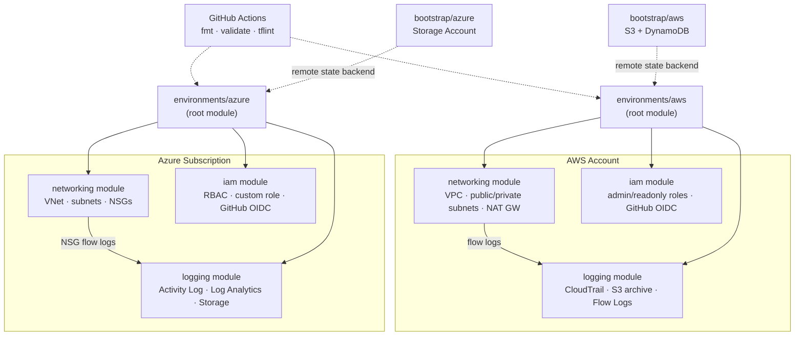

# Multi-Cloud Landing Zone

A real, deployable Terraform reference architecture for a foundational
**landing zone** — the baseline of networking, identity, and logging that
every workload in an account/subscription builds on top of — implemented
twice, once per cloud, from the same design:

- **AWS**: VPC + public/private subnets across AZs, NAT Gateways, IAM roles
  (break-glass admin, read-only, GitHub Actions OIDC), account-wide CloudTrail
  + VPC Flow Logs into a centralized, encrypted S3 archive.
- **Azure**: VNet + subnets with per-subnet NSGs, Entra ID RBAC (built-in
  roles + a custom least-privilege role, GitHub Actions workload identity
  federation), subscription Activity Log + NSG flow logs into a Log
  Analytics workspace.

Both clouds share the same three-module shape (`networking`, `iam`,
`logging`), composed by a thin root module per environment. That symmetry is
the point: it's the same landing-zone *pattern*, not a copy-paste of one
cloud's idioms onto the other.

## Why this exists

Most "Terraform portfolio" repos are a single flat `main.tf` with a VM and a
security group. This one is scoped and structured the way a real platform
team's foundational repo is: reusable modules, environment-specific root
configs, remote state with locking, and a CI pipeline that actually validates
the code on every change — because a landing zone that's wrong is wrong for
every workload built on top of it.

## Architecture



## Repository layout

```
modules/
  aws/{networking,iam,logging}/    # reusable, cloud-specific building blocks
  azure/{networking,iam,logging}/
environments/
  aws/                             # root module composing the 3 AWS modules
    envs/{dev,prod}.tfvars          # non-secret per-environment values
    envs/{dev,prod}.backend.hcl     # per-environment remote state config
  azure/                           # root module composing the 3 Azure modules
bootstrap/
  aws/                             # one-time: creates the S3 state bucket + lock table
  azure/                           # one-time: creates the state storage account + containers
.github/workflows/terraform.yml    # fmt, validate and tflint on every change
```

Each module is self-contained (`main.tf`, `variables.tf`, `outputs.tf`,
`versions.tf`) and takes no opinion on remote state or provider
authentication — that's the root module's job, so the same module works in
any environment.

## Design decisions

- **No long-lived cloud credentials for CI/CD.** Both clouds are wired for
  OIDC/workload-identity federation (`aws_iam_openid_connect_provider` +
  scoped role; `azuread_application_federated_identity_credential`), gated
  behind `enable_github_oidc` since it needs your actual GitHub org/repo to
  be useful.
- **Group-based access, not per-user grants.** IAM/RBAC roles are assumed by
  principal ARNs / Entra ID group object IDs passed in as variables — access
  changes are a group-membership change, not a Terraform apply.
- **Logging is wired first, then networking depends on it.** Flow logs need
  somewhere to land before they can be turned on, so the root module always
  composes `logging` before `networking` and threads the log destination
  outputs in.
- **Partial backend configuration.** `backend.tf` declares the backend type
  only; the bucket/container/key differ per environment and are supplied via
  `-backend-config=envs/<env>.backend.hcl` at `terraform init` time, so the
  same code is used for dev and prod.
- **Defaults are conservative.** NAT Gateways, encryption, versioning,
  public-access blocking, and TLS 1.2 minimums are all on by default;
  cost-saving shortcuts (e.g. `single_nat_gateway`) are opt-in per
  environment, not baked into the module.

## Usage

### 1. Bootstrap remote state (once per account/subscription)

```bash
# AWS
terraform -chdir=bootstrap/aws init
terraform -chdir=bootstrap/aws apply -var="name_prefix=lz"
# note the bucket names from the output, then update
# environments/aws/envs/*.backend.hcl to match

# Azure
terraform -chdir=bootstrap/azure init
terraform -chdir=bootstrap/azure apply -var="name_prefix=lz"
# note the storage_account_name output, then update
# environments/azure/envs/*.backend.hcl to match
```

### 2. Deploy an environment

```bash
cd environments/aws
terraform init -backend-config=envs/dev.backend.hcl
terraform plan  -var-file=envs/dev.tfvars
terraform apply -var-file=envs/dev.tfvars
```

Same pattern for `environments/azure`. Authenticate with your normal
`aws configure` / `az login` — no credentials live in this repo.

### 3. CI

Every pull request runs `terraform fmt -check`, `terraform init -backend=false`
+ `terraform validate` against every module and environment, and `tflint`.
This is deliberately where full provider-schema validation happens: it needs
to reach the Terraform provider registry, which a sandboxed authoring
environment may not have egress to — so treat a green CI run as the
authoritative "this HCL is valid" check.

## Extending this

- Add a `modules/{aws,azure}/compute` or `.../kubernetes` module and compose
  it in `environments/*/main.tf` the same way networking/iam/logging are
  composed.
- Add a `staging` environment by copying an `envs/*.tfvars` +
  `envs/*.backend.hcl` pair — no module changes needed.
- Swap the AWS DynamoDB lock table for Terraform's native S3 locking
  (`use_lockfile`, Terraform ≥ 1.10) once you've standardized on a recent
  enough Terraform version.

## License

MIT — see [LICENSE](LICENSE).
